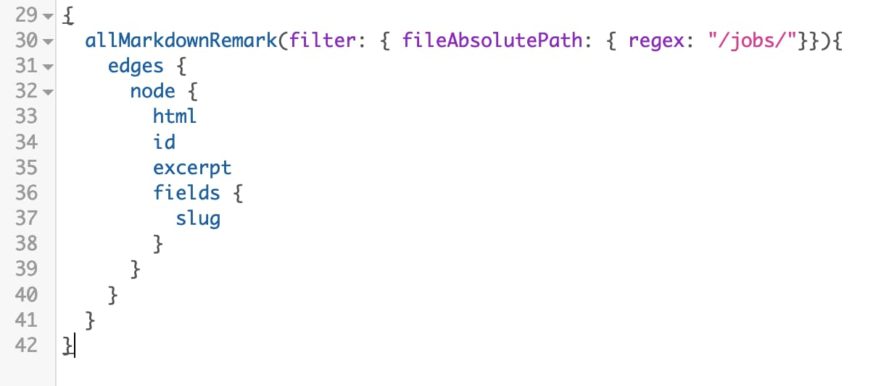

I thought it would be good to have a working example of a resume using a similar structure to how GatsbyJS generates blog entries. I started my research with gatsby docs however I ended up using a list of google searches for similar questions.

* [StackOverflow - Gatsby: Multiple Content Types](https://stackoverflow.com/questions/50242492/gatsby-multiple-content-types)
* [Samuel W - Building Gatsby With Multiple Post Type](https://desktopofsamuel.com/building-gatsby-with-multiple-post-type)

I chose to use the [gatsby default starter blog](https://github.com/gatsbyjs/gatsby-starter-blog#v2) since it's super simple and gives a good idea of how to use the graphql. Using the layout of the content folder at the base of the theme, I chose to create a folder called jobs and structure it similarly to the default blog folder.

```
content
——blogs
    —— Blog Post #1
		——index.md
——jobs
	——Job #1
		——index.md	
```

Each job will be somewhat structured like the blog entries:

```
title: "Application Analyst/Developer, Senior"
startdate: 2017-01-01
enddate: 2018-04-30
location: "Oxford, GA"
company: "Emory University"
```

I will be using the dates for ordering the content, as well as using enddate value to determine what is my current job. I chose to go simpler and did not include a category filter on the each markdown file. I will be using graphql to filter by path, which works for my example.

For this to work, I did the same as Samuel W and added to my `gatsby-config.js`:
```
{
	resolve: `gatsby-source-filesystem`,
	options: {
		path: `${__dirname}/content/jobs`,
		name: `jobs`,
	},
},
```
Using this allows graphql to find my list of jobs. However, using it just this way will have the posts and jobs show up all together on the index page, which I don't want. I don't need to add anything to the `gatsby-node.js`. These jobs will only be listed on my resume, and don't need their own additional pages. 

Here's the query I created using graphiql:



Source for the page is [here](https://github.com/stepquick/stepquick.github.io/blob/source/src/pages/resume.js).

It's similar to how index.js works, however I am filtering for "/jobs/" path instead. This means I needed to adjust my `src/pages/index.js` to filter the results, otherwise I would get both jobs and the blog entries.

`filter: { fileAbsolutePath: { regex: "/blog/"} } `

I also don't need to worry about linking to the jobs, I will only be printing them out to the generated page. 

The results turned out nicely with relatively little css to modify it. You can see the live page here: [resume](https://stepquick.net/resume).


