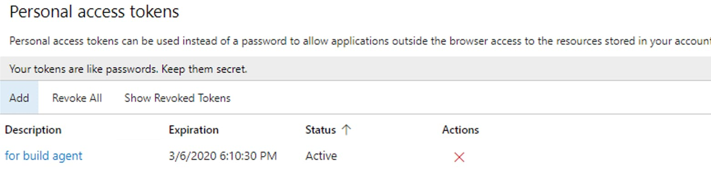
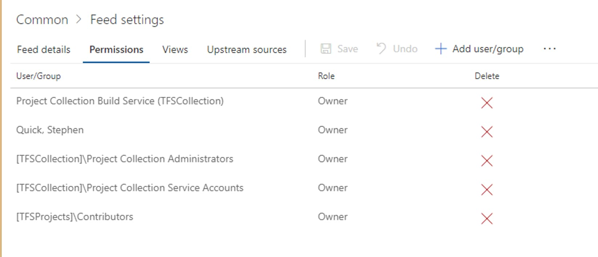
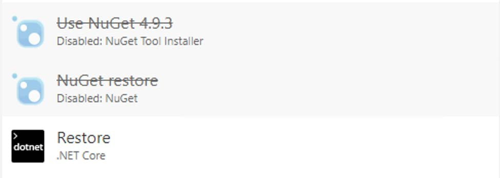

These are the notes I kept while experimenting with using TFS for automating deployment at my job. While these are a little about after the fact, but I felt it would be useful for someone looking to automate their asp projects.

1. Use PAT (Personal Access Tokens) authentication
2. You can easily update the tfs agent if you run it as a service 
3. For private nuget feed, make sure your build agent has permission to use it
4. dotnet restore and caching issues
5. What account to use for the agent? 
6. Update TFS regularly
7. TFVC < GIT
8. The power of continuous integration

### 1. Use PAT (Personal Access Tokens) authentication

When I started with configuring the agents, by default it was using Windows Authentication as the default auth type. However, through tutorials using a PAT seems to be the best way to have this set up. The personal access token was set up using my user under TFS, and I set it to expire after a year and only has access to the agent feed. At the time of this blog you can learn more about PAT using the Microsoft Docs: [here](https://docs.microsoft.com/en-us/azure/devops/pipelines/agents/v2-windows?view=azure-devops). It also looks like as of the newest version of self-hosted TFS, PAT is the default authentication type for agent configuration now.

### 2. You can easily update the agent if you run it as a service
I didn't realize this initially, but running the agent as a service allows you to modify the agent directly services.msc on the host computer. This allows you to set the typical stuff, including changing a password and restarting the user. It came in quite handy experimenting with what user to use for the agent.

### 3. For private nuget feed, make sure your build agent has permission to use it
Initially I attempted to run the build agent using Network Service, which was the default user. Even selecting the proper permissions for the private nuget feed (azure artifacts) hosted by my jobs tfs instance, I ended up not being able to get the user to authenticate properly every time I ran a new build. I ended up using my user for running the agent, as well as using my personal pat. This seems to work better but coming across this stack overflow question [here](https://stackoverflow.com/questions/26313455/the-account-running-the-tfs-build-service-nt-authority-network-service-needs-t) I might need to target the domain\computer specifically.

### 4. Dotnet restore has permission issues with cached private nuget feeds
This may be related to me switch back and forth between branches on TFVC on my build definitions, so I'm making an note. Sometimes my build agent fails the build for not being able to access the private nuget feed (azure artifacts), which shouldn't be the case considering my user is the owner for the private nuget feed. I think it may be related to switching which branch builds. That could be related, but my solution seems to fix it:

Toggling in between these steps (nuget restore) and (dotnet restore) seems to work really well for clearing this up. I think it's really something related to caching between the different branches.

### 5. What account should I use for the agent?
I ultimately chose my user for running the agent because:
1. My user has access to tfs, including our private nuget feed.
2. I can easily make a PAT for it just for being used by the agent.
3. Using my user account was easier than figuring out how the network service user works. I think this meant using the domain/name for the feed. This however may not be ideal for my job.

Long term, it may make more sense to create a specific user for this, and the feed, but it becomes more complicated.

### 6. Update TFS regularly
When I started using my jobs TFS instance, it was 6 months out of date. Updating to the latest version (2018 Update 3) added a lot of additional functionality that came in handy, so I would recommend that if you can, update the tfs instance, it will help. I have noticed the vm controlling this tfs does have more noticeable performance issues.

### 7. TFVC < Git
My jobs codebase is primarily in a monolith Team Foundation Version Control repo. The long term goal I would want to see is splitting out projects into separate Git repos. TFS can also host these in addition to TFVC making it super convenient to store them together. My takeaways from the migration to TFS Git are:
1. Git feels less complicated with its branching system.
2. Branches in TFVC are folders, not branches.
	a. Those "branches" from TFVC complicate project builds:
	b. note: I was never able to use path triggers for a tfvc based build because my project relies on npm to install js dependencies. This step requires specifying a folder, which I can only specify one branch at a time, making it harder to minimize redundancy. 

### 8. The power of continuous integration
Being able to merge into dev or master and have a build automatically deploy is pretty magical. However this comes with a built of a learning curve; It took me over a few weeks to iron out all the issues I faced creating an continous integration plan. I still feel like it was worth investigating; no more manual publishing, no more manual testing. TFS can automate all this. 